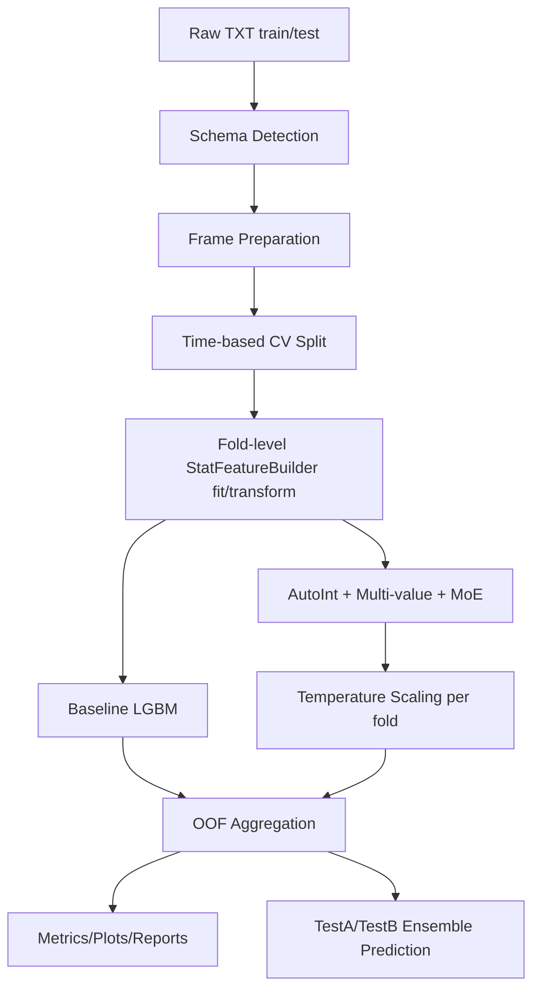

# IJCAI-18 Alimama pCVR End-to-End Project

一个围绕 **天池 IJCAI-18 阿里妈妈搜索广告转化预测** 的完整工程化项目，目标是实现：

- 可复现训练与推理
- 严格时序验证（防泄漏）
- 从 baseline 到主模型（AutoInt + Multi-value Attention + Drift-aware MoE + Calibration）的全链路实现
- 自动化评估产物（AUC / Logloss / ECE / 按天 / 按场景）
- 可直接用于面试讲解的技术闭环

---

## 1. 任务定义与业务背景

### 1.1 任务定义
- 任务类型：二分类概率预估（pCVR）
- 预测目标：`P(is_trade=1 | user, item, context, shop, query-intent)`
- 主指标：`Logloss`（天池常用提交指标）
- 辅指标：`AUC`
- 扩展指标：`ECE`（Expected Calibration Error，概率校准质量）

### 1.2 数据特点
- 标签极不平衡：正例占比低（约 1.89%）
- 多个高基数字段（`*_id`）
- 存在多值字符串字段（用 `;` 分隔）
- 存在 `-1` 缺失哨兵值
- 时间分布非平稳，存在明显天级波动，必须做时序验证

### 1.3 为什么不能只看 AUC
- AUC 关注排序，不直接约束概率绝对值是否可信
- pCVR 在业务中常用于出价/排序混合决策，概率失真会直接影响收益
- 因此本项目强制引入 **温度缩放校准**，输出校准前后 Logloss/ECE

---

## 2. 项目结构

```text
ijcai18/
├── configs/
│   ├── train.yaml
│   ├── train_autoint_moe_long.yaml
│   └── predict.yaml
├── data/
│   └── README.md
├── outputs/
│   ├── cache/
│   ├── experiments/
│   ├── reports/
│   └── train.log
├── prompt/
│   └── prompt.md
├── src/
│   ├── train.py
│   ├── predict.py
│   ├── pipeline.py
│   ├── schema.py
│   ├── feature_engineering.py
│   ├── baseline_lgbm.py
│   ├── autoint_data.py
│   ├── autoint_trainer.py
│   ├── calibration.py
│   ├── evaluation.py
│   ├── splits.py
│   ├── settings.py
│   └── models/autoint_moe.py
├── requirements.txt
└── README.md
```

---

## 3. 环境与数据准备

### 3.1 依赖
见 `requirements.txt`：
- `numpy`, `pandas`, `scikit-learn`, `pyyaml`, `matplotlib`
- `lightgbm`
- `torch`
- `tabulate`, `tqdm`

### 3.2 安装示例

```bash
cd /Users/zheli/code/ijcai18
python -m venv .venv
source .venv/bin/activate
pip install -r requirements.txt
```

### 3.3 数据放置
将以下文件放在 `data/` 目录：

- `round1_ijcai_18_train_20180301.txt`
- `round1_ijcai_18_test_a_20180301.txt`
- `round1_ijcai_18_test_b_20180418.txt`

参考：`data/README.md`

---

## 4. 一键训练与推理

### 4.1 训练

```bash
python -m src.train --config configs/train.yaml
```

### 4.2 只做推理

```bash
python -m src.predict --config configs/predict.yaml --split test_a
python -m src.predict --config configs/predict.yaml --split test_b
```

### 4.3 输出文件（核心）
- `outputs/experiments/<exp_name>/fold_*/`：每折模型与元数据
- `outputs/experiments/<exp_name>/oof.csv`：OOF 预测（校准前后）
- `outputs/experiments/<exp_name>/metrics.json`：全局指标
- `outputs/experiments/<exp_name>/metrics_by_day_oof.csv`
- `outputs/experiments/<exp_name>/metrics_by_scenario_oof.csv`
- `outputs/experiments/<exp_name>/reliability_diagram.png`
- `outputs/experiments/<exp_name>/day_cvr_curve.png`
- `outputs/reports/ablation_results.csv`：消融对比
- `outputs/reports/overall_summary.json`：总览摘要
- `outputs/pred_test_a.csv`, `outputs/pred_test_b.csv`：提交文件

---

## 5. 端到端流水线（各阶段输入/输出）

### 5.1 总流程图



### 5.2 阶段 I/O 详解

| 阶段 | 输入 | 处理 | 输出 |
|---|---|---|---|
| Schema 检测 | 原始 DataFrame | 自动识别 instance/time/multi-value/numeric/categorical | `DataSchema` |
| Frame 准备 | 原始 DataFrame + Schema | 时间列拆分、`-1` 缺失指示、多值缓存解析、match 特征 | `PreparedFrame(df, missing_cols, match_cols, mv_len_cols)` |
| 时间切分 | train_df + `day` | 滚动时间折（过去训练，未来验证） | `list[Fold]` |
| 统计特征 | train_fold/valid_fold | 平滑 CVR + 频次 log + drift score/scenario | `tr_aug`, `va_aug`, `stat_cols` |
| 训练 | 增强后 fold 数据 | baseline 或 autoint 路径训练 | 每折模型 + fold metrics |
| 校准 | valid logits + labels | 温度缩放（fold 内） | calibrated probs |
| 聚合评估 | OOF 预测 + 元数据 | overall/day/scenario 指标，图表 | `metrics.json` + csv/png |
| 提交预测 | test_a/test_b | 多折模型平均预测 | `pred_test_a.csv`, `pred_test_b.csv` |

---

## 6. 数据处理与特征工程（代码级）

### 6.1 自动 Schema 识别（`src/schema.py`）

### 做了什么
- 自动识别：
  - 标签列（默认 `is_trade`）
  - 实例 ID 列（如 `instance_id`）
  - 时间戳列（名称匹配 + 数值范围兜底）
  - 多值字段（采样检测是否含 `;`）
- 整型字段自动判别数值型/类别型：
  - 若列名含 `_id` 或 unique 值很多，判为类别
  - 否则判为数值
- 自动记录含 `-1` 的列，用于缺失指示特征

### 产物
- `DataSchema`（训练与推理共用）
- `day`, `hour`（由 timestamp 自动拆分）
- `is_missing__*` 指示列

### 6.2 多值字段解析与缓存（`src/feature_engineering.py`）

### 字段处理
对检测到的多值列生成：
- `mv_tokens__{col}`：token list
- `mv_len__{col}`：序列长度（`int16`）

### 缓存策略
- 缓存键：`split_name + 行数 + multi_value_cols` hash
- 缓存文件：`outputs/cache/mv_cache_*.pkl`
- 目的：避免重复解析字符串，提升重复实验速度

### 6.3 手工 match 特征（`predict_category_property` vs `item`）

自动构造：
- `match_cat_hit_cnt`
- `match_cat_jaccard`
- `match_cat_cover_item`
- `match_cat_cover_pred`
- `match_main_cat_hit`
- `match_prop_hit_cnt`
- `match_prop_jaccard`
- `match_prop_cover_item`
- `match_prop_cover_pred`

这些特征既供 baseline 使用，也可作为主模型 dense 输入。

### 6.4 统计特征（`StatFeatureBuilder`）

### 1) 平滑 CVR
对每个 group 列（默认 user/item/shop + 可选 brand）计算：

\[
\text{cvr}_{g} = \frac{\sum y + \alpha}{\text{count} + \alpha + \beta}
\]

其中：
- \(\alpha = \bar y \cdot \text{prior_strength}\)
- \(\beta = (1-\bar y) \cdot \text{prior_strength}\)

目的：缓解低频组 CVR 不稳定。

### 2) 长尾频次信号
- 对 `freq_cols` 统计频次
- 转换为 `log_freq_* = log1p(count)`

### 3) 漂移分数与场景标签
按天 CVR 做 z-score：

\[
\text{drift\_score}(d) = \frac{\text{CVR}(d) - \mu_{day\_CVR}}{\sigma_{day\_CVR}}
\]

- 若 `abs(drift_score) >= drift.zscore_threshold`（默认 1.0） => `Drift`
- 否则 => `Normal`

> 说明：这套定义是项目内的工程策略，不是比赛官方标签。

---

## 7. 模型结构详解

### 7.1 Baseline：LightGBM（`src/baseline_lgbm.py`）

### 输入
- 数值类：dense 特征（含时间、缺失指示、统计特征、match 特征等）
- 类别类：单值离散字段（映射为 index）

### 特点
- 作为对照与诊断基线
- 对时间切分与随机切分均可评估
- 训练速度快，便于验证特征是否有效

### 7.2 主模型：AutoInt + Multi-value Attention + Drift-aware MoE

实现文件：`src/models/autoint_moe.py`, `src/autoint_data.py`, `src/autoint_trainer.py`

### A. 输入编码
1. 单值类别字段：embedding（含 OOV）
2. 多值字段：token embedding + attention pooling
3. dense 特征：标准化后参与 deep/wide 分支
4. gate 特征：`day/hour/drift_score/log_freq_*`（标准化）

### B. Multi-value Attention Pooling
- query 来自 gate 输入映射（`query_proj(gate)`）
- 每个多值字段独立 attention pool
- 相比 mean pooling，更能做条件化聚合

### C. AutoInt Backbone
- token 序列输入多层 `MultiheadAttention`
- 残差 + LayerNorm + FFN
- 输出 flatten 后接 shared MLP

### D. Drift-aware MoE
- `num_experts` 默认 3（Normal / Drift / Long-tail 语义分工）
- gate 网络输入 gate 特征，softmax 产生专家权重
- 最终 logit = `sum(gate_w * expert_logit)`

### E. Wide & Deep（可选）
- `use_wide_deep=true` 时开启：
  - dense tower（deep dense 表征）
  - wide linear（线性可解释分支）

### F. 不平衡学习
- 默认：weighted BCE（支持动态 `pos_weight=neg/pos`）
- 可选：Focal Loss

### G. 防专家塌缩
- `load_balancing_loss`: 惩罚专家平均权重偏离均匀分布

### H. 概率校准
- fold 内对 valid logits 做温度缩放（LBFGS 优化）
- 输出校准前后 AUC/Logloss/ECE

---

## 8. 训练策略与验证设计

### 8.1 时间交叉验证（核心）
- `make_time_based_folds` 按 day 升序滚动切分
- 每折只用过去训练，未来验证
- 配置：`time_cv.n_folds`, `time_cv.val_days`

### 8.2 随机切分对照（泄漏风险展示）
- 使用分层随机拆分单独训练 baseline
- 输出到 `outputs/reports/random_split_metrics.json`
- 用于说明“随机切分通常偏乐观”

### 8.3 早停与训练稳定性
- 监控 valid logloss
- `early_stop_patience` 控制早停
- `clip_grad` 防梯度爆炸
- 初始化输出偏置为 `prior_logit` 缓解初期不稳定

---

## 9. 配置文件说明（高频超参）

核心配置：`configs/train.yaml`

### 9.1 数据与路径
- `paths.data_dir`, `train_file`, `test_a_file`, `test_b_file`
- `paths.output_dir`, `paths.cache_dir`

### 9.2 CV
- `time_cv.n_folds`
- `time_cv.val_days`
- `time_cv.random_valid_size`

### 9.3 特征
- `features.cvr_group_cols`
- `features.freq_cols`
- `features.prior_strength`

### 9.4 漂移
- `drift.zscore_threshold`

### 9.5 AutoInt 模型
- `embed_dim`, `attn_layers`, `num_heads`, `dropout`
- `shared_hidden`, `expert_hidden`
- `num_experts`
- `dense_tower_hidden`

### 9.6 训练
- `epochs`, `batch_size`, `lr`, `weight_decay`
- `loss`（`weighted_bce` / `focal`）
- `dynamic_pos_weight`, `pos_weight`
- `load_balance_weight`, `wide_l2`

### 9.7 实验开关（Ablation）
每个 `experiments` 条目支持：
- `model_type`: `baseline` / `autoint`
- `use_moe`
- `use_multivalue_attention`
- `use_wide_deep`
- `use_calibration`
- `include_match_features`
- `disable_long_tail_features`

---

## 10. 产物字典（面向复现与排查）

### 10.1 每折产物
`outputs/experiments/<exp>/fold_<k>/`
- `model.pkl`（baseline）或 `model.pt`（autoint）
- `preprocessor.pkl`（autoint）
- `stat_builder.pkl`
- `fold_meta.json`
- `metrics_by_day.csv`
- `metrics_by_scenario.csv`

### 10.2 实验级产物
`outputs/experiments/<exp>/`
- `oof.csv`
- `metrics.json`
- `metrics_by_day_oof.csv`
- `metrics_by_scenario_oof.csv`
- `reliability_diagram.png`
- `day_cvr_curve.png`
- `expert_weights.csv`（MoE）
- `expert_weight_by_day.png`（MoE）

### 10.3 全局报告
`outputs/reports/`
- `ablation_results.csv`
- `ablation_results.md`
- `overall_summary.json`
- `random_split_metrics.json`

---

## 11. 实验对比与分析框架

> 当前本地仓库未包含历史实验结果文件（`outputs/reports` 为空），以下给出标准解读框架与已知结论。建议运行训练后自动生成完整表格。

### 11.1 必做消融组
1. `baseline_lgbm`
2. `autoint_without_moe`
3. `autoint_multivalue_no_moe`
4. `autoint_moe_no_calibration`
5. `autoint_moe_calibrated`

可选补充：
- `autoint_dense_wide_deep_no_moe`
- `autoint_dense_wide_deep_calibrated_no_moe`
- 去掉 match 特征
- 去掉 long-tail 特征或降低 load balancing

### 11.2 如何看结果（推荐顺序）
1. 先看 `oof_logloss_after`（主指标）
2. 再看 `oof_auc_after`（排序能力）
3. 看 `ece_before/ece_after`（校准收益）
4. 看 `metrics_by_scenario_oof.csv`（Normal/Drift 稳定性）
5. 看 `expert_weight_by_day.png`（MoE 是否“懂得切场景”）

### 11.3 已确认的关键结论（最近一次服务器记录）
- 在同一份 `oof.csv` + 同一份 `drift_scenario` 标记口径下，
  - baseline 的 Drift AUC 约为 **0.6238**
  - stacking 尝试的 Drift AUC 约为 **0.5651**
- 结论：stacking 在 Drift 场景出现退化，已回滚，不纳入主线。

> 注：该结论用于项目复盘说明；最终对外报告请以当前代码重新跑出的 `outputs/reports/ablation_results.csv` 为准。

---

## 12. 为什么 test 没 label 还能做场景分析？

- `test_a/test_b` 没有 `is_trade`，不能计算真实 AUC/logloss。
- 场景分析（Normal/Drift）发生在 **训练的 OOF/验证集** 上：
  - 先有真实 label，才能算指标。
- OOF 场景标签的实现里采用了“全训练集 drift map 近似分桶”：
  - 这是用于分析的近似划分，不是 test 真值评估。

---

## 13. 关键实现思路（可复述版本）

### 13.1 为什么要同时保留 `-1` 类别和缺失指示
- `-1` 作为类别 embedding 能学习“缺失值模式”
- `is_missing__x` 让模型显式知道是否缺失
- 二者结合通常比“直接填 0”更稳

### 13.2 为什么多值字段要 attention pooling
- 平均池化默认每个 token 等权
- 实际上用户意图与商品属性相关性不同
- query 条件化 attention 能把权重放在更相关 token 上

### 13.3 为什么 MoE 用 day/hour + drift_score + log_freq
- day/hour：刻画时间上下文
- drift_score：显式捕捉“今天是否偏离常态”
- log_freq：区分头部/长尾样本，帮助专家分工

### 13.4 为什么还要做校准
- 不平衡任务中，模型常“排序可以，概率偏移”
- 温度缩放不改排序（AUC 基本稳定），但常改善 Logloss/ECE

---

## 14. 面试高概率考点（含答题框架）

### 14.1 原理类
1. 为什么时序 CV 比随机 CV 更可信？
2. Beta-Binomial 平滑 CVR 的意义是什么？
3. AutoInt 相比 DNN/FM 的优势？
4. Attention pooling 与平均池化区别？
5. MoE 如何避免 expert collapse？
6. Temperature scaling 为什么常只改善 Logloss/ECE？

### 14.2 工程类
1. 多值解析为什么要缓存？如何设计 cache key？
2. 训练/推理如何保证 schema 一致？
3. 如何保证 fold 内不泄漏？
4. 如何把 ablation 做成一键配置切换？
5. OOF 文件用于哪些下游分析？

### 14.3 追问类（高频）
1. `drift_score` 阈值怎么定？
- 回答：工程默认 1.0，可在验证集网格调参；本项目放在 config，便于重现。
2. 如果 Drift 场景样本很少怎么办？
- 回答：可调阈值、合并近邻天、或改分位数划分，防止分组过稀导致指标噪声。
3. MoE 专家权重几乎不变怎么办？
- 回答：检查 gate 特征质量、提高 load balancing 权重、降低 gate dropout、看 expert 初始化。
4. 如果 calibration 后 AUC 下降？
- 回答：理论上温度缩放是 logit 单调变换，AUC 应近似不变；若明显下降，多数是实现链路错误或数据对齐问题。

### 14.4 一段 60 秒项目陈述模板
“这是一个 pCVR 预测项目。我先用自动 schema 识别和多值解析构建特征，基线是带平滑统计特征和匹配特征的 LightGBM。主模型采用 AutoInt 学交互，再用条件化 attention 处理多值字段，并引入 Drift-aware MoE，让 gate 根据 day/hour、day-level drift z-score 和 long-tail 频次选择专家。训练阶段用严格 time-based CV 防泄漏，针对不平衡用 weighted BCE/focal，最后在每个 fold 内做温度缩放，输出校准前后 Logloss 和 ECE。整个流程的 OOF、分天指标、分场景指标和可视化都自动落盘，便于实验复现和面试复盘。”

---

## 15. 常见问题（FAQ）

### Q1. `StatFeatureBuilder` 是什么？
它是项目自定义的统计特征构建器，负责：
- 平滑 CVR 映射
- 频次映射（`log_freq_*`）
- day-level `drift_score` 与 `drift_scenario`

### Q2. z-score 是什么？
标准化分数，表示“离均值几个标准差”：
\[
z = (x - \mu)/\sigma
\]

### Q3. `drift.zscore_threshold` 是比赛给的吗？
不是官方给定，是工程阈值超参，默认 1.0，可调。

### Q4. 现在项目 MoE 几个专家？
默认 `num_experts: 3`（在 `configs/train.yaml` 与 `configs/train_autoint_moe_long.yaml`）。

### Q5. test 集没有标签，怎么评估？
- test 只能产出提交概率文件
- 评估指标都来自 train OOF / fold valid

---

## 16. 复现实验建议顺序

1. 先跑 `baseline_lgbm`，确认数据路径和特征流程正确。
2. 再跑 `autoint_without_moe` 与 `autoint_multivalue_no_moe`，验证主干增益。
3. 打开 `use_moe`，检查 `expert_weights.csv` 是否有分工。
4. 打开 `use_calibration`，检查 ECE/Logloss 是否改善。
5. 最后查看 `ablation_results.csv` 和 `metrics_by_scenario_oof.csv` 做结论。

---

## 17. 当前仓库状态说明

- 代码具备完整训练/推理/报告生成能力。
- 实验结果文件不是代码的一部分；若你清空了 `outputs/`，需要重新跑训练生成报告。
- README 中所有流程、输入输出、模块逻辑均与当前 `src/` 实现对齐。

---

## 18. License / Usage

该项目为竞赛复现与工程实践用途。若用于对外发布，请补充：
- 数据来源声明
- 模型使用限制
- 隐私与合规声明

