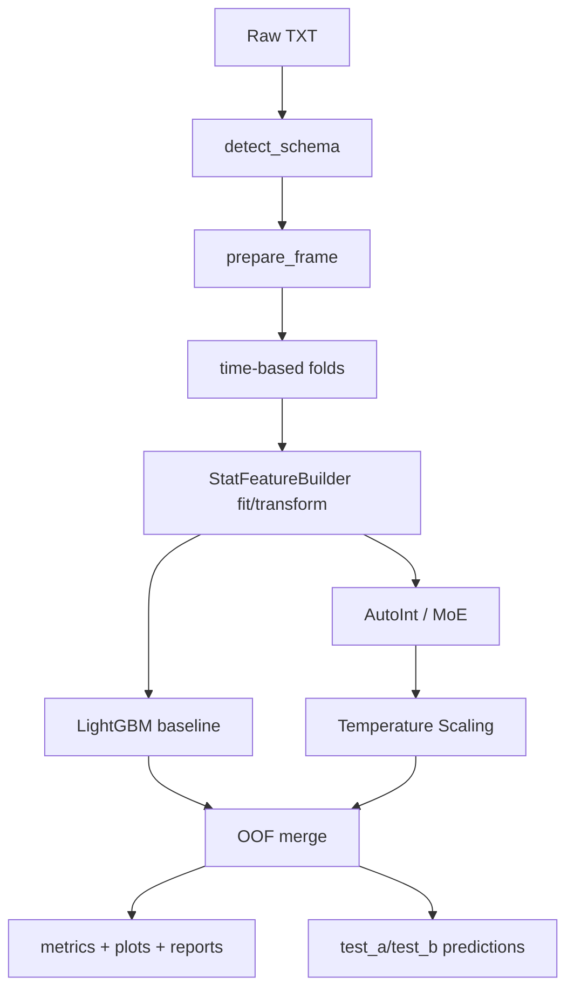

# IJCAI-18 Alimama pCVR End-to-End Project

基于天池 IJCAI-18 阿里妈妈搜广数据集的端到端 pCVR 预测工程项目。

这个 README **按服务器当前代码与实验产物**编写，关键数字来源于：
- `outputs/reports/ablation_results.csv`
- `outputs/reports/random_split_metrics.json`
- `outputs/experiments/*/metrics.json`
- `outputs/experiments/*/metrics_by_scenario_oof.csv`
- `outputs/train.log`

---

## 1. 当前版本快照（服务器真实状态）

- 项目路径：`/home/zheli/project/ijcai18`
- Git 提交：`f733994`
- 训练数据：`round1_ijcai_18_train_20180301.txt`
- 测试数据：`round1_ijcai_18_test_a_20180301.txt`, `round1_ijcai_18_test_b_20180418.txt`
- 主要报告存在于：
  - `outputs/reports/ablation_results.csv`
  - `outputs/reports/overall_summary.json`
  - `outputs/reports/random_split_metrics.json`

---

## 2. 任务定义

- 任务：二分类 pCVR 预测，目标 `P(is_trade=1|x)`
- 主指标：`Logloss`
- 辅指标：`AUC`
- 概率质量指标：`ECE`
- 数据特征：
  - 标签极不平衡（正例约 1.89%）
  - 存在 `-1` 缺失哨兵值
  - 存在多值字段（`;` 分隔）
  - 明显时间漂移（按 day）

---

## 3. 项目结构

```text
ijcai18/
├── configs/
│   ├── train.yaml
│   ├── train_autoint_moe_long.yaml
│   └── predict.yaml
├── data/
│   └── README.md
├── outputs/
│   ├── cache/
│   ├── experiments/
│   ├── reports/
│   ├── runs/
│   ├── pred_test_a.csv
│   ├── pred_test_b.csv
│   └── train.log
├── src/
│   ├── train.py
│   ├── predict.py
│   ├── schema.py
│   ├── pipeline.py
│   ├── feature_engineering.py
│   ├── baseline_lgbm.py
│   ├── autoint_data.py
│   ├── autoint_trainer.py
│   ├── calibration.py
│   ├── evaluation.py
│   ├── splits.py
│   └── models/autoint_moe.py
└── README.md
```

---

## 4. 环境与运行

### 4.1 依赖安装

```bash
cd /home/zheli/project/ijcai18
pip install -r requirements.txt
```

### 4.2 训练

```bash
python -m src.train --config configs/train.yaml
```

### 4.3 推理

```bash
python -m src.predict --config configs/predict.yaml --split test_a
python -m src.predict --config configs/predict.yaml --split test_b
```

---

## 5. 端到端流程（含阶段输入输出）



| 阶段 | 输入 | 核心处理 | 输出 |
|---|---|---|---|
| Schema | 原始 DataFrame | 自动识别 id/time/multi-value/cat/num | `DataSchema` |
| Prepare | DataFrame + Schema | 时间拆解、缺失指示、多值解析缓存、match 特征 | `PreparedFrame` |
| Split | train_df + day | 时间滚动验证（过去训未来验） | `Fold[]` |
| Stat | train_fold/valid_fold | 平滑 CVR / log_freq / drift_score / drift_scenario | `tr_aug`, `va_aug` |
| Train | fold 数据 | baseline 或 autoint 训练 | 每折模型 |
| Calibration | valid logits+labels | 温度缩放 | 校准后概率 |
| Eval | OOF + meta | overall/day/scenario 指标与图 | `metrics.json`, csv/png |
| Predict | test_a/test_b | 多折平均 | `pred_test_a.csv`, `pred_test_b.csv` |

---

## 6. 数据处理与特征工程（代码口径）

### 6.1 自动字段识别（`src/schema.py`）
- 自动识别 `instance_id`、`context_timestamp`、多值列（含 `;`）
- 整型列按规则拆分为 categorical / numeric
- 含 `-1` 的列记录为 `missing_sentinel_cols`
- 自动生成 `day` / `hour`

### 6.2 多值字段（`src/feature_engineering.py`）
- `item_category_list`, `item_property_list`, `predict_category_property` 解析为 token list
- 缓存文件：`outputs/cache/mv_cache_*.pkl`
- 生成 `mv_len__*`

### 6.3 匹配特征（handcrafted）
- 类目/属性命中数、覆盖率、Jaccard、主类目命中
- 特征前缀：`match_*`

### 6.4 统计特征与漂移标签（`StatFeatureBuilder`）
- 平滑 CVR（Beta-Binomial）
- 频次特征：`log_freq_* = log1p(count)`
- 漂移分数：按 day 的 CVR 相对均值做 z-score
- 场景定义：
  - `abs(drift_score) >= drift.zscore_threshold` => `Drift`
  - 否则 => `Normal`
- 当前阈值：`drift.zscore_threshold = 1.0`

---

## 7. 模型结构

### 7.1 Baseline（`src/baseline_lgbm.py`）
- 输入：dense + 单值类别映射后的特征
- 模型：LightGBM
- 用途：强基线、快速诊断、时序口径对照

### 7.2 主模型（`src/models/autoint_moe.py`）

`AutoInt + Multi-value Attention + (可选)MoE + (可选)Wide&Deep + Temperature Scaling`

- 单值类别 embedding
- 多值字段 attention pooling（query 由 gate 输入映射）
- AutoInt 多头自注意力层
- shared MLP 表征
- 可选 wide 分支 + dense tower
- 不平衡损失：weighted BCE / focal
- MoE 负载均衡辅助损失

### 7.3 当前配置中的专家数
- `configs/train.yaml`：`num_experts: 3`
- 注意：报告中还包含 `moe2` 实验（2 专家），见 `ablation_results.csv` 与 `outputs/train.log` 的 2026-03-07 记录。

---

## 8. 实验设置

### 8.1 验证策略
- Time-based CV：`n_folds=3`, `val_days=2`
- 同时输出 random split 对照（仅用于泄漏风险对比）

### 8.2 关键训练超参（`configs/train.yaml`）
- `epochs=5`, `batch_size=1024`, `lr=1e-3`
- `loss=weighted_bce`, `dynamic_pos_weight=true`
- `load_balance_weight=0.01`
- `use_gpu=true`

---

## 9. 服务器实测结果（来自 ablation_results.csv）

下表为当前服务器产物中的 OOF 汇总指标（`after` 为校准后）：

| experiment | model_type | oof_auc_after | oof_logloss_after | ece_after |
|---|---|---:|---:|---:|
| baseline_lgbm | baseline | 0.567125 | **0.092366** | 0.001916 |
| autoint_without_moe | autoint | 0.525093 | 0.180431 | 0.018479 |
| autoint_multivalue_no_moe | autoint | 0.540052 | 0.173509 | 0.016982 |
| autoint_moe_no_calibration | autoint | 0.526245 | 0.173402 | 0.015132 |
| autoint_moe_calibrated | autoint | 0.545345 | 0.106156 | 0.007925 |
| autoint_dense_wide_deep_no_moe | autoint | 0.540909 | 0.192786 | 0.015657 |
| autoint_dense_wide_deep_calibrated_no_moe | autoint | **0.569991** | 0.100475 | 0.005901 |
| autoint_dense_wide_deep_moe2_no_calibration | autoint | 0.539483 | 0.189411 | 0.017497 |
| autoint_dense_wide_deep_moe2_calibrated | autoint | 0.566842 | 0.100073 | **0.005582** |

### 9.1 结论（按当前服务器实验）
- **Logloss 最优仍是 baseline_lgbm（0.092366）**。
- 深度模型里：
  - AUC 最优：`autoint_dense_wide_deep_calibrated_no_moe`（0.569991）
  - Logloss/ECE 最优：`autoint_dense_wide_deep_moe2_calibrated`（0.100073 / 0.005582）
- 校准收益显著：
  - 例如 `autoint_moe_calibrated` 从 0.176100 降到 0.106156

### 9.2 Random split 对照
- `outputs/reports/random_split_metrics.json`：
  - AUC: 0.500645
  - Logloss: 0.094183

---

## 10. Normal / Drift 场景分析（服务器实测）

来自 `metrics_by_scenario_oof.csv`：

| experiment | Drift AUC | Drift Logloss | Normal AUC | Normal Logloss |
|---|---:|---:|---:|---:|
| baseline_lgbm | **0.623850** | **0.086358** | 0.559084 | 0.094854 |
| autoint_moe_calibrated | 0.489450 | 0.116678 | 0.564085 | 0.101798 |
| autoint_dense_wide_deep_calibrated_no_moe | 0.546229 | 0.100555 | **0.586913** | 0.100441 |
| autoint_dense_wide_deep_moe2_calibrated | 0.549126 | 0.103545 | 0.578711 | 0.098635 |

结论：
- baseline 在 Drift 场景明显更稳（AUC/Logloss 均领先）。
- 深度模型在 Normal 场景有一定 AUC 优势，但 Drift 鲁棒性不足。

---

## 11. MoE 诊断（服务器当前产物）

以 `autoint_moe_calibrated/metrics.json` 为例：
- `mean_w0 ≈ 0.99945`
- `mean_w1 ≈ 0.00024`
- `mean_w2 ≈ 0.00008`

这说明当前训练下 gate 几乎塌缩到单专家，MoE 分工未有效发挥。

`autoint_dense_wide_deep_moe2_calibrated` 稍好（`mean_w0≈0.9897`, `mean_w1≈0.0103`），但仍偏单专家。

---

## 12. 为什么 test 没 label 还能做场景指标？

- `test_a/test_b` 没有 `is_trade`，不能计算真实 AUC/Logloss。
- 场景指标全部来自训练 OOF/验证集。
- OOF 场景报告使用“全训练集拟合 drift map”做近似分桶，属于分析口径，不是 test 真值评估。

---

## 13. 训练产物说明

### 13.1 每折目录
`outputs/experiments/<exp>/fold_k/`
- 模型：`model.pkl` 或 `model.pt`
- `preprocessor.pkl`（autoint）
- `stat_builder.pkl`
- `fold_meta.json`
- `metrics_by_day.csv`
- `metrics_by_scenario.csv`

### 13.2 实验级目录
`outputs/experiments/<exp>/`
- `oof.csv`
- `metrics.json`
- `metrics_by_day_oof.csv`
- `metrics_by_scenario_oof.csv`
- `reliability_diagram.png`
- `day_cvr_curve.png`
- MoE: `expert_weights.csv`, `expert_weight_by_day.png`

### 13.3 全局目录
`outputs/reports/`
- `ablation_results.csv`
- `ablation_results.md`
- `overall_summary.json`
- `random_split_metrics.json`

---

## 14. 面试高概率考点（结合本项目真实结果）

1. 为什么时序 CV 是必要的？
- 回答重点：防未来信息泄漏；本项目 random split 指标不具参考性。

2. 为什么要校准？
- 回答重点：排序与概率质量是两件事；本项目多个模型校准后 Logloss 显著下降。

3. 为什么 MoE 没有带来预期收益？
- 回答重点：gate 塌缩（权重极端偏单专家），可从 `metrics.json` 的 mean_w 直接举证。

4. 为什么 baseline 仍然强？
- 回答重点：统计特征+匹配特征在小样本高稀疏下更稳，尤其在 Drift 场景。

5. 如何定义 Normal/Drift？
- 回答重点：day-level CVR z-score + 阈值（当前 1.0），是工程定义，不是官方标签。

6. 下一步优化方向是什么？
- 回答重点：
  - 增强 gate 输入并正则化，抑制单专家塌缩
  - 针对 Drift 场景做专门重采样/重加权
  - 提升长训练稳定性（epochs/patience/学习率计划）

---

## 15. FAQ

### Q1. `StatFeatureBuilder` 是自定义的吗？
是，本项目自定义模块，负责统计特征、drift_score 与 drift_scenario 构造。

### Q2. z-score 是什么？
标准化分数：`z = (x - 均值) / 标准差`。

### Q3. `drift.zscore_threshold` 是比赛给的吗？
不是。它是工程超参，当前默认 1.0。

### Q4. 现在 MoE 是几个专家？
主配置默认 3 个；实验报告中另有 2 专家变体（moe2）。

### Q5. test 集怎么评估？
test 无标签，只能产出提交文件；评估在 OOF/验证集完成。

---

## 16. 当前结论（仅基于服务器现有结果）

- 若目标是当前口径下的最优 Logloss：`baseline_lgbm` 仍最佳。
- 若希望提升深度模型：`wide+deep + calibration` 是当前有效方向。
- 若继续用 MoE：优先解决 gate 塌缩，再谈专家分工收益。

